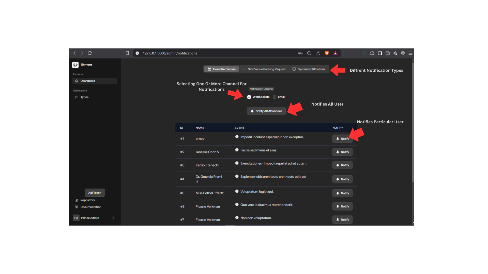
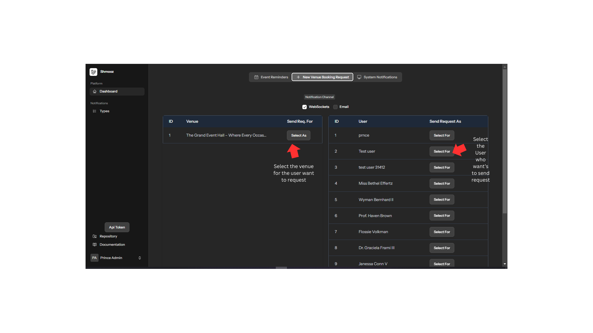

# Configuration And Installation for Shmooz app

## Environment Variables

Set up your `.env` file with the following MongoDB configuration:

```ini
DB_CONNECTION=mongodb
DB_HOST=localhost
DB_PORT=27017
DB_DATABASE=my_app_db
DB_USERNAME=myUser
DB_PASSWORD=mySecurePass123
```

Setup The Mailing system..
```ini
MAIL_MAILER=smtp
MAIL_HOST=smtp.mywebsite.com
MAIL_PORT=587
MAIL_USERNAME=my_smtp_user_name
MAIL_PASSWORD="a_secured_password"
MAIL_ENCRYPTION=tls
MAIL_FROM_ADDRESS=youremail@mymail.com
MAIL_FROM_NAME="Shmooz App"
```

## Database Configuration

In your `config/database.php` file, ensure the MongoDB connection is properly configured:

```php
'mongodb' => [
    'driver'   => 'mongodb',
    'host'     => env('DB_HOST', 'localhost'),
    'port'     => env('DB_PORT', 27017),
    'database' => env('DB_DATABASE', 'my_app_db'),
    'username' => env('DB_USERNAME', 'myUser'),
    'password' => env('DB_PASSWORD', 'mySecurePass123'),
    'options'  => [
        // Additional settings for the MongoDB driver
        // See: https://www.php.net/manual/en/mongodb-driver-manager.construct.php
        'database' => env('DB_AUTHENTICATION_DATABASE', 'admin'), // Required for MongoDB 3+
    ],
],
```

## Installation

1. Installing composer packages
    ```bash
    composer install
   ```
2. Install the required MongoDB package for Laravel:
   ```bash
   composer require mongodb/laravel-mongodb
   ```
3. Install Broadcasting:
   ```bash
   php artisan install:broadcasting
   ```
4. Installing Node Packages
    ```bash
    npm i
    ```
    or 
    ```bash
    npm install
    ```

5. Generate a App key 
    ```bash
    php artisan key:generate
    ```

6. Clear the configuration cache:
   ```bash
   php artisan config:clear
   ```
7. Starting the Serve
    Run your Laravel application:
    ```bash
    php artisan serve
    ```
8. Start the Npm - vite app for better experience
   ```bash
   npm run dev
   ```

9. Start the webhook - Laravel Reverb server
    using --debug falg for debuging the requests
   ```bash
   php artisan reverb:start --debug
   ```

## Database seeding & Migrating

1. Migrate Your Database with the following command
    ```bash
    php artisan migrate
    ```
    
2. Use seeder to perform test and interact with sample data
    ```bash
    php artisan db:seed
    ```

## Verifying the Connection
To ensure MongoDB is properly connected, run the following command:
```bash
php artisan tinker
```
Then, execute:
```php
DB::connection('mongodb')->getMongoDBName();
```
If everything is set up correctly, it should return your database name.
---

# Notifications API

## Overview
This API handles notifications for users, supporting different types such as event reminders, venue requests, and system notifications. Notifications can be sent via web sockets or email.

## Base URL
```
/api/notifications
```

## Routes

### 1. Send Notification
**Endpoint:**
```
POST /api/notifications/send
```
**Middleware:**
- `AdminApiMiddleware`

**Request Body:**
```json
{
    "notification_type": "event_reminder",
    "notification_channel": "web_sockets",
    "user_id": 1,
    "event_id": 5
}
```

**Notification Types:**
| Type               | Required Params |
|--------------------|----------------|
| event_reminder    | `event_id`, `user_id` |
| new_venue_request | `user_id`, `venue_id` |
| system_notifications | None |

**Notification Channels:**
- `web_sockets`
- `email`

**Responses:**
- `200 OK`: Notification Sent Successfully
- `400 Bad Request`: Validation Error or Unable to Send Notification

---

### 2. Retrieve User Notifications
**Endpoint:**
```
GET /api/notifications/{user_id}
```
**Path Parameter:**
- `user_id` (integer) - ID of the user

**Response:**
```json
{
    "data": [
        "..."
    ]
}
```

---

### 3. Mark Notification as Read
**Endpoint:**
```
PUT /api/notifications/mark-as-read/{notification_id}
```
**Path Parameter:**
- `notification_id` (integer) - ID of the notification

**Response:**
```json
{
    "response": "Marked As Read"
}
```

## Error Handling
- `400 Bad Request`: Invalid request parameters
- `404 Not Found`: User or Notification not found

## Dashboard Testing For Admin..
URL: 

1. Admin Login Route
```
admin/login
```

2. Admin Dashboard Route
```
admin/dashboard
```

## Explanation Event reminder type


## New Booking Request For Admin Side..


## System Notifications


## User And Owner Route.
1. User Login route 
```
/login
```

2. Owner route 
```
/owner/login
```

## User Interface of notifications..
.png>)

User and owner has the same notification interface for realtime updates

## Api token access in admin dashboard
.png>)

## Known Issues
If encounter any issues related to web socket or reverb
run the following command

```
php artisan reverb:restart
```